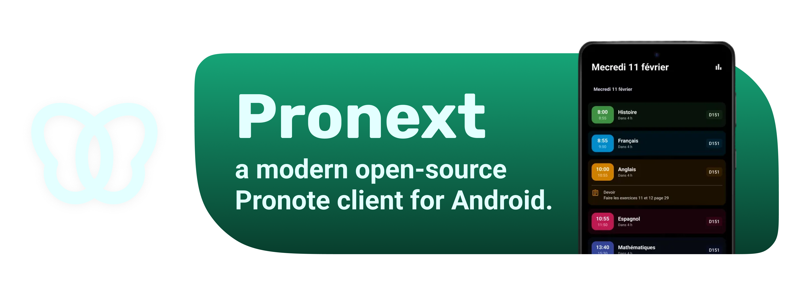
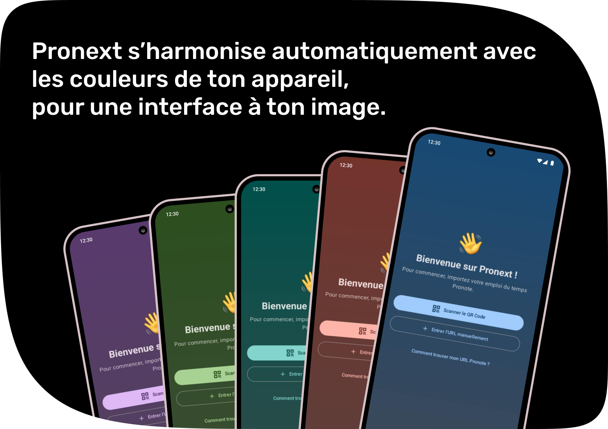
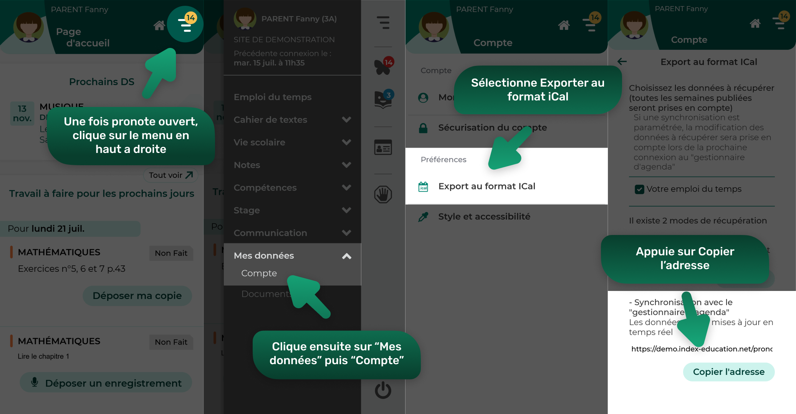
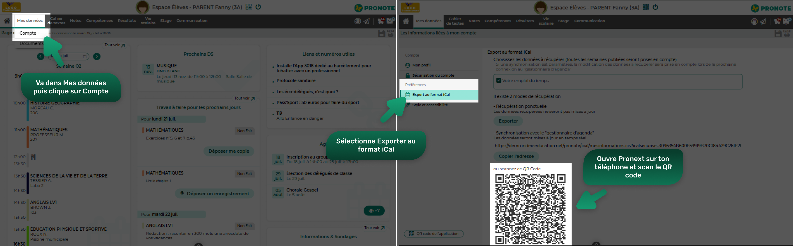
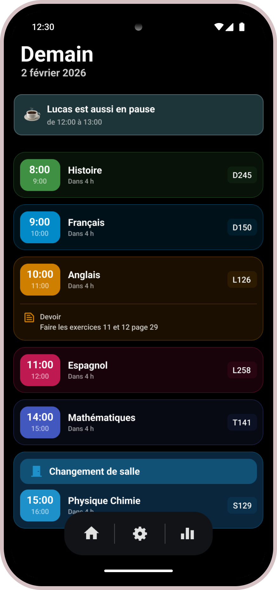
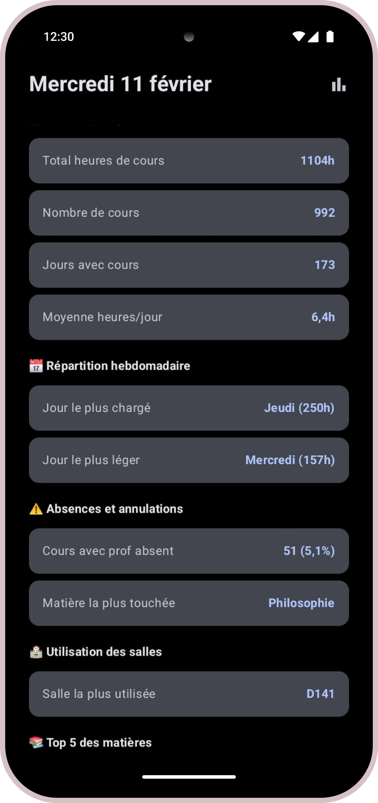
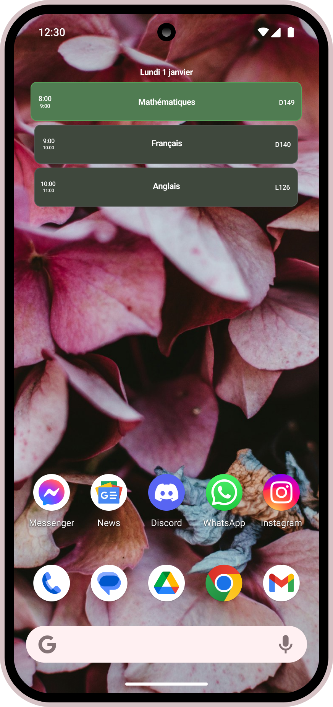

  

<h1 align="center">Pronext</h1>

  <b>a modern and open source Pronote client for Android.</b> 

  
  
  

---

## ✨ Fonctionnalités

### 📅 Emploi du temps & devoirs
- Affichage **en temps réel** de l’emploi du temps
- Mise à jour automatique lors des changements (annulations, déplacements)

### 📊 Statistiques scolaires
- Statistiques globales de l’année
- Traitement des données 100% local.
- Répartition du temps par matière
- Journées chargées / légères
- Heures de cours annulées
 *et pleins d'autres...*

### 👥 Fonctions sociales
- Visualisation de l’EDT de tes amis
- **Comparateur de pauses communes**
- Détection automatique des créneaux partagés

### 🎨 Interface
- Interface moderne basée sur **Material You**
- Couleurs dynamiques selon le thème du système
- Économe, fluide et compatible ecran **OLED**
  
 
 
---

## 🔑 Comment connecter Pronext à Pronote

Pronext utilise **l’export iCal officiel de Pronote**.  
👉 **Aucun identifiant n’est récupéré**, tout passe par un lien fourni par Pronote.

### 📱 Sur téléphone

1. Ouvre **Pronote** (application ou version web)
2. Va dans l’onglet **Mes données**
3. Appuie sur **Compte**
4. Sélectionne **Exporter au format iCal**
5. Appuie sur **Copier l’adresse**

 

6. Ouvre **Pronext**
7. Colle le lien iCal dans le champ prévu

✅ Ton emploi du temps et tes cours apparaissent automatiquement.

### 💻 Sur PC (navigateur)

1. Ouvre **Pronote** dans ton navigateur
2. Va dans **Mes données**
3. Clique sur **Compte**
4. Sélectionne **Exporter au format iCal**
5. Un **QR code** s’affiche

 

6. Ouvre **Pronext** sur ton téléphone
7. Utilise le **scanner de QR code intégré**
8. Valide l’import

✅ Les données sont maintenant disponibles dans Pronext.

💡 **Astuce** :  
Tu peux maintenant partager ton EDT avec tes amis pour savoir quand ils sont en pause.

---

## 🔐 Respect de la vie privée

🔒 **Pronext ne collecte aucune donnée personnelle.**

- Aucun serveur externe
- Aucun compte Pronext nécéssaire
- Identifiants stockés localement
- Traitement local des statistiques

---

## 📱 Screenshots
  
⭐ Parce que Pronote mérite une interface à la hauteur de son importance.

  
  
  

---

## 🗺️ Roadmap

- [x] Widget Android des 3 prochains cours *(beta)*
- [x] Statistiques annuelles *(beta)*
- [x] Gestion des amis
- [x] Partage rapide de données entre amis
- [x] Détection des pauses communes
- [x] Ajout d'une "IA" pour détecter les événements.
- [x] compatibilité pour les collèges
- [x] amélioration de l'affichage des devoirs
- [ ] Fonctionne hors ligne après import
- [ ] Notification des profs absent.

---

## 🤝 Contribuer

Le code du projet n'est pas encore disponible. Pour toutes questions ou améliorations, contactez-moi.

Même une petite amélioration ou une idée est appréciée 💙

---

## 📄 Licence

Ce projet est sous licence **MIT**.

Cela signifie que tu peux :
- utiliser le code
- le modifier
- le redistribuer

À condition de conserver la licence et les crédits.

---

  <i>
    Pronext n’est pas affilié à Pronote. 
  </i>

